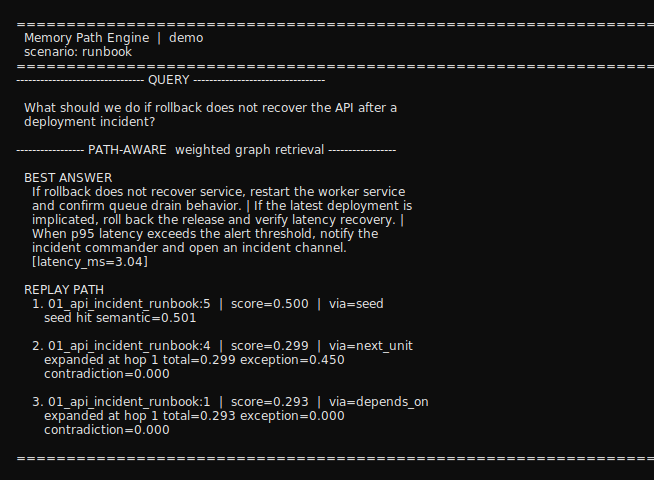

# Memory Path Engine

[](https://github.com/ly85206559/memory-path-engine/actions/workflows/ci.yml)
[](https://www.python.org/downloads/)
[](LICENSE)
[](docs/vision.md)

Structured memory retrieval for AI agents that returns evidence paths, not just `top-k` chunks. Think **navigable memory** in a memory-palace-style sense: a graph you can walk, not only a flat similarity list.

`Memory Path Engine` is a research-first prototype for moving beyond flat retrieval. Instead of treating memory as an unordered vector index, it models memory as typed nodes, edges, weights, and replayable paths so a system can retrieve, traverse, and explain how it reached an answer.

This repository is aimed at people exploring agent memory, graph-aware retrieval, and explainable evidence chains across more than one document shape.

### System shape (v0 + Memory Palace v1)

Bundled markdown packs are ingested into an in-memory graph (`MemoryNode` / `MemoryEdge`, with weights). Retrievers return a `MemoryPath`: a composed answer plus ordered steps you can inspect. The CLI demo exercises exactly this path end to end.

**Memory Palace v1** adds a parallel domain (`memory_engine.memory`): `MemoryPalace`, typed memories, and `PalaceRecallResult` (retrieved items + routes + activation snapshot). It maps to the same `MemoryStore` via `palace_to_store`, so existing retriever modes are unchanged. See [`docs/architecture.md`](docs/architecture.md) for the compatibility picture.

```text
 examples/*_pack  ──▶  ingest  ──▶  MemoryStore (typed graph)
                                        │
                         ┌──────────────┼──────────────┐
                         ▼              ▼              ▼
                   BaselineTopK    other modes    WeightedGraph
                   (flat answers)  in `retrieve`  (path + scores)
                                        │
                                        ▼
                         stitched answer + replayable step list
```

## Why this project is different

Most RAG systems still look like this:

1. Split documents into chunks.
2. Embed chunks.
3. Return `top-k` matches.
4. Ask the LLM to improvise the reasoning.

This repo explores a different question:

> Can we retrieve a memory path instead of only retrieving similar chunks?

The prototype is built around three ideas:

- `structure`: memory is not flat; it has typed nodes and edges
- `weight`: not every memory should be treated equally
- `path`: retrieval should expose the chain of evidence, not hide it

## What you can do here

- compare multiple retrieval modes in one codebase
- inspect replayable evidence paths instead of only final answers
- test graph-aware retrieval on contract-like and operational documents
- run repository-owned structured benchmarks instead of toy snippets

## Quick start

Maintainers: configure the GitHub link-card image using [docs/social-preview.md](docs/social-preview.md) (`docs/assets/open-graph-cover.png`).

Install the project in editable mode:

```bash
python -m pip install --no-build-isolation -e .
```

Run the test suite:

```bash
python -m unittest discover -s tests -v
```

Run the runbook demo:

```bash
python -m memory_engine.demo --scenario runbook
```

Terminal-style capture of real stdout (refresh with `python scripts/generate_runbook_demo_terminal_svg.py`; `latency_ms` may differ run to run):



Run the contract comparison demo:

```bash
python -m memory_engine.demo --scenario contract
```

Run the HotpotQA tiny benchmark smoke check:

```bash
python scripts/run_hotpotqa_benchmark.py
```

Run the LongMemEval tiny benchmark smoke check:

```bash
python scripts/run_longmemeval_benchmark.py
```

Print compact v1 palace metadata (spaces, routes, memory kinds) per case:

```bash
python scripts/run_longmemeval_benchmark.py --v1-recall-summary
```

Download the official HotpotQA dev distractor file for local benchmark runs:

```bash
python scripts/download_hotpotqa.py
```

Download the cleaned LongMemEval-S file for local benchmark runs:

```bash
python scripts/download_longmemeval.py
```

### What you will see

`python -m memory_engine.demo` prints a small banner, the query, then path-aware output: a **BEST ANSWER** line built from the winning walk, and a **REPLAY PATH** with one line per hop (`node id`, `score`, `via=<edge type>`) plus short scoring reasons on the following lines. With `--scenario contract`, a **BASELINE** block (flat top-k answers) appears above the path-aware section for the same query.

Representative runbook excerpt (answer line shortened; latency and hop scores can vary slightly between runs):

```text
========================================================================
  Memory Path Engine  |  demo
  scenario: runbook
========================================================================
-------------------------------- QUERY ---------------------------------
  What should we do if rollback does not recover the API after a
  deployment incident?
----------------- PATH-AWARE  weighted graph retrieval -----------------
  BEST ANSWER
    … stitched runbook units … [latency_ms=…]

  REPLAY PATH
    1. 01_api_incident_runbook:5  |  score=0.500  |  via=seed
       seed hit semantic=0.501
    2. 01_api_incident_runbook:4  |  score=0.299  |  via=next_unit
       expanded at hop 1 total=0.299 exception=0.450 contradiction=0.000
========================================================================
```

## What the demos show

### Runbook demo

The runbook demo loads incident and recovery procedures, then asks a multi-step operational question:

```text
What should we do if rollback does not recover the API after a deployment incident?
```

The output includes:

- a **BEST ANSWER** line composed from the graph walk
- a **REPLAY PATH** with per-step scores, `via` edge types, and short reasons

For a representative stdout excerpt, see **What you will see** (under Quick start).

### Contract demo

The contract demo runs the same query through a baseline retriever and the weighted graph retriever. Stdout shows flat top-k answers first, then the path-aware best answer and replay steps, so you can compare shapes of evidence without relying on a single aggregate metric.

## Retrieval modes in this repo


| Retriever                | What it emphasizes                  | Useful for                                   |
| ------------------------ | ----------------------------------- | -------------------------------------------- |
| lexical baseline         | keyword overlap                     | simple lookups and sanity checks             |
| embedding baseline       | semantic similarity                 | paraphrases and fuzzy matches                |
| structure-only traversal | graph connectivity                  | linked evidence exploration                  |
| weighted graph retrieval | structure plus importance weighting | multi-hop retrieval with replayable evidence |
| activation spreading v1  | explicit propagation with decay     | graph diffusion experiments                  |


## Why the examples span multiple document types

The core is meant to stay domain-agnostic. The current examples use both contract-like documents and runbooks because together they stress:

- hierarchical structure
- exception and dependency chains
- critical risk-bearing units
- procedural and operational steps
- strong need for evidence-backed reasoning

If the retrieval and replay ideas cannot survive across these document types, they are unlikely to generalize well to other structured knowledge domains.

## Repository layout

- [`src/memory_engine`](src/memory_engine): schema, storage, ingestion, retrieval, scoring, replay
- [`examples/contract_pack`](examples/contract_pack): contract-like demo pack with dense dependencies and exceptions
- [`examples/runbook_pack`](examples/runbook_pack): operational runbook pack for procedural retrieval
- [`benchmarks/structured_memory`](benchmarks/structured_memory): typed benchmark fixtures and evaluation assets
- [`docs`](docs): architecture, evaluation, hypotheses, and project vision
- [`tests`](tests): unit tests for schema, retrieval behavior, and benchmark support

## Read this first

- [`docs/vision.md`](docs/vision.md): why this project exists and where it is heading
- [`docs/architecture.md`](docs/architecture.md): how the current system is structured
- [`docs/evaluation.md`](docs/evaluation.md): how retrieval modes are compared
- [`docs/benchmark-strategy.md`](docs/benchmark-strategy.md): how public, repo-owned, and private benchmarks should be used
- [`docs/private-contract-dataset-guide.md`](docs/private-contract-dataset-guide.md): how to build and annotate a private contract golden set
- [`docs/hypotheses.md`](docs/hypotheses.md): milestone hypotheses and success criteria

## Research hypotheses

The first milestone tests three claims:

- `H1`: graph-aware retrieval beats vanilla `top-k` retrieval on multi-hop questions
- `H2`: anomaly and importance weighting improve recall of critical evidence
- `H3`: replayable memory paths improve explainability without unacceptable latency

## Experimental framework

The retrieval stack separates:

- candidate generation
- semantic similarity backend
- scoring strategy
- path replay

That separation makes it possible to compare lexical baseline, embedding baseline, structure-only traversal, and weighted graph retrieval without rewriting the main search loop.

The evaluation layer can emit detailed per-question reports, which is useful for miss analysis and ablation debugging instead of relying only on a single aggregate score.

The repository also includes a dedicated structured benchmark bounded context with:

- strong pydantic dataset models
- a JSON repository for benchmark fixtures
- application services that load datasets, build stores, and run retrievers end to end

## Benchmarks

The benchmark story is intentionally split into three layers:

- **External positioning:** LongMemEval retrieval-only session recall (`R@5`, `R@10`, `NDCG@10`) for broad long-memory comparison
- **Public retrieval sanity:** HotpotQA evidence retrieval on distractor-style multi-document questions
- **Mechanism validation:** repository-owned structured fixtures for path, semantic, contradiction, and dynamic-memory behavior

Current run matrix:

- `benchmarks/structured_memory/*.json`: CI
- `benchmarks/structured_memory/spatial_recall_benchmark.json`, `route_replay_benchmark.json`, `consolidation_gain_benchmark.json`, `state_transition_benchmark.json`: Layer B checks for palace-oriented expectations (space, route shape, diffusion gain, lifecycle)
- `benchmarks/external/hotpotqa/hotpot_tiny_fixture.json`: CI
- `benchmarks/external/hotpotqa/data/*.json`: local / nightly
- `benchmarks/external/longmemeval/longmemeval_tiny_fixture.json`: local smoke
- `benchmarks/external/longmemeval/data/*.json`: local / manual

## What is in scope for v0

- minimal `MemoryNode`, `MemoryEdge`, `MemoryPath`, and `EvidenceRef` schema
- an in-memory store for fast iteration
- simple ingestion paths for multiple example document styles
- multiple retrieval modes in one research harness
- a small synthetic contract evaluation set for end-to-end experiments

## What is out of scope for now

- production infrastructure
- MCP integration
- multi-modal memory encoding
- online reinforcement and forgetting policies
- large-scale benchmarks
- full UI

## Planned next steps

- add explicit anomaly detectors and contradiction edges
- expand the evaluation runner with ablation reports and latency summaries
- extend the `domain_pack` interface for more domains such as code, research notes, and policy-like documents
- add stronger embedding backends behind the same `EmbeddingProvider` interface

For suggested GitHub topic tags (About section), see [`docs/github-topics.md`](docs/github-topics.md).

## License

MIT. See [`LICENSE`](LICENSE).