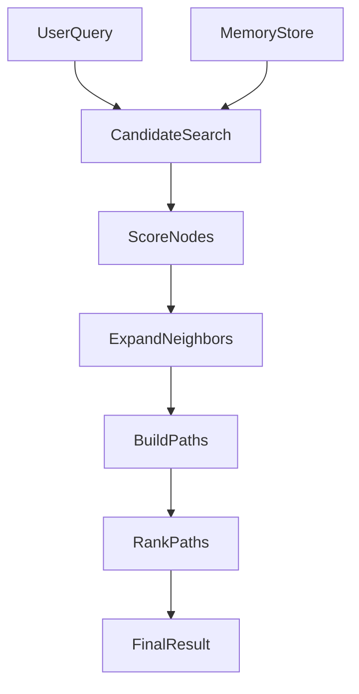

# Architecture

`Memory Path Engine` is intentionally small in v0. The goal is to validate the memory model before scaling infrastructure.

## Core abstractions

### `MemoryNode`

A typed unit of memory content.

Suggested first-class fields:

- `id`
- `type`
- `content`
- `attributes`
- `importance`
- `risk`
- `novelty`
- `confidence`
- `usage_count`
- `decay_factor`
- `source_ref`

### `MemoryEdge`

A typed relationship between two nodes.

Suggested first-class fields:

- `from_id`
- `to_id`
- `edge_type`
- `weight`
- `confidence`
- `bidirectional`
- `source_ref`

### `EvidenceRef`

A stable pointer back to source material.

It should support:

- file path
- section or clause identifier
- optional character span or line span

### `MemoryPath`

A replayable explanation of how retrieval moved from query to evidence.

Minimum fields:

- `query`
- `steps`
- `supporting_evidence`
- `final_answer`
- `final_score`

## Retrieval flow



## Scoring model

The first scoring function is intentionally simple:

```text
final_score = semantic_score * semantic_weight
            + structural_score * structural_weight
            + anomaly_score * anomaly_weight
            + importance_score * importance_weight
```

Where:

- `semantic_score` measures overlap between query and node content
- `structural_score` rewards traversable supporting edges
- `anomaly_score` rewards nodes marked as risky, conflicting, unusual, or exception-bearing
- `importance_score` rewards nodes that matter more even if they are not lexically dominant

## Domain-pack strategy

The core should stay domain-agnostic. Domain packs should provide:

- ingestion conventions
- node typing rules
- edge typing rules
- weight heuristics
- evaluation tasks

Current validation pack:

- `contract_pack`

Future candidates:

- `code_pack`
- `research_pack`
- `support_pack`

## Baselines

The repository starts with three conceptual modes:

1. `baseline_topk`
   Plain lexical or embedding-based retrieval without structure.
2. `structure_only`
   Retrieval with node and edge awareness, but no extra weighting.
3. `weighted_graph`
   Retrieval with structure, weighting, and replayable paths.

## Storage model

v0 uses an in-memory store so iteration stays fast.

Later storage backends can include:

- sqlite
- graph database
- vector store
- hybrid graph plus vector backends
