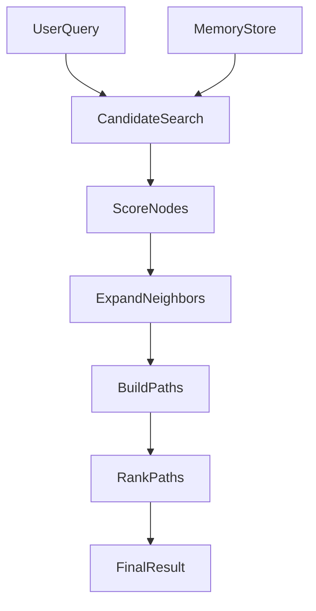

# Architecture

`Memory Path Engine` is intentionally small in v0. The goal is to validate the memory model before scaling infrastructure.

This document focuses on the current implementation architecture. For the higher-level design intent, principles, and roadmap, see [`vision.md`](vision.md).

## Scope

This file answers:

- what core objects exist in the current implementation
- how retrieval is assembled today
- which extension points are already exposed

This file does not try to fully explain the long-term motivation for the project. That belongs in [`vision.md`](vision.md).

## Core abstractions

### `MemoryNode`

A typed unit of memory content.

Suggested first-class fields:

- `id`
- `type`
- `content`
- `attributes`
- `importance`
- `risk`
- `novelty`
- `confidence`
- `usage_count`
- `decay_factor`
- `source_ref`

### `MemoryEdge`

A typed relationship between two nodes.

Suggested first-class fields:

- `from_id`
- `to_id`
- `edge_type`
- `weight`
- `confidence`
- `bidirectional`
- `source_ref`

### `EvidenceRef`

A stable pointer back to source material.

It should support:

- file path
- section or clause identifier
- optional character span or line span

### `MemoryPath`

A replayable explanation of how retrieval moved from query to evidence.

Minimum fields:

- `query`
- `steps`
- `supporting_evidence`
- `final_answer`
- `final_score`

## Retrieval flow




## Retrieval components

The v0 retrieval stack is now split into explicit extension points:

- `EmbeddingProvider`: produces query and node embeddings
- `EmbeddingTopKRetriever`: runs semantic candidate generation
- `ScoringStrategy`: converts semantic hits plus memory weights into ranked path steps
- `WeightedGraphRetriever`: combines candidate search, neighbor expansion, and path replay

## Scoring model

The first scoring function is intentionally simple:

```text
final_score = semantic_score * semantic_weight
            + structural_score * structural_weight
            + anomaly_score * anomaly_weight
            + importance_score * importance_weight
```

Where:

- `semantic_score` is provided by the active embedding backend
- `structural_score` rewards traversable supporting edges
- `anomaly_score` rewards nodes marked as risky, conflicting, unusual, or exception-bearing
- `importance_score` rewards nodes that matter more even if they are not lexically dominant

## Domain-pack strategy

The core should stay domain-agnostic. Domain packs should provide:

- ingestion conventions
- node typing rules
- edge typing rules
- weight heuristics
- evaluation tasks

In the current codebase, this starts with a small `DomainPack` abstraction and a registry-backed example pack for contract-like benchmark documents. The intent is to let future packs supply their own ingestion and graph-building logic without rewriting the retrieval core.

Current example packs:

- `example_contract_pack` (with `contract_pack` kept as a backward-compatible alias)
- `example_runbook_pack`

Future candidates:

- `code_pack`
- `research_pack`
- `support_pack`

## Baselines

The repository starts with these conceptual modes:

1. `lexical_baseline`
  Plain lexical retrieval without structure.
2. `embedding_baseline`
  Embedding-based retrieval without graph expansion.
3. `structure_only`
  Retrieval with node and edge awareness, but no extra weighting.
4. `weighted_graph`
  Retrieval with structure, weighting, and replayable paths.
5. `activation_spreading_v1`
  Seed selection plus explicit activation propagation along edges with decay and thresholds.

## Storage model

v0 uses an in-memory store so iteration stays fast.

Later storage backends can include:

- sqlite
- graph database
- vector store
- hybrid graph plus vector backends

## Bounded contexts

The repository is beginning to separate responsibilities into clearer bounded contexts:

- `memory core`: node, edge, path, retrieval, and domain-pack abstractions
- `structured benchmark`: strongly typed benchmark datasets, fixture loading, and evaluation services

This split is meant to support DDD-style evolution: domain concepts stay explicit, and application services orchestrate them without collapsing everything into utility modules.

## Memory Palace v1 (parallel to the legacy graph stack)

v1 adds an explicit **palace domain** under `src/memory_engine/memory/`:

- **Domain**: `MemoryPalace`, `PalaceSpace`, typed memories (`EpisodicMemory`, `SemanticMemory`, `RouteMemory`), `MemoryLink`, `DomainMemoryState`, and `MemoryStateMachine`.
- **Bridge**: `palace_to_store` / `store_to_palace` map between v1 objects and the existing `MemoryStore` + `MemoryNode` / `MemoryEdge` so all current retrievers keep working.
- **Recall layering**: `PalaceRecallResult` holds `retrieved_memories`, `routes`, and `activation_snapshot`, derived from a legacy `RetrievalResult` via `RetrievalResult.palace_result` (filled by retrievers in `retrieve.py`). Public benchmarks prefer this list when ranking session-like items.
- **Retriever construction**: `build_legacy_retriever` in `retrieval_factory.py` is shared by the benchmark service and `RetrieveMemoryService`, avoiding import cycles with the runner.
- **Dynamic lifecycle on nodes**: `MemoryStatePolicy` still mutates `MemoryWeight`, and also writes `lifecycle_state`, `reinforcement_count`, and `stability_score` on `MemoryNode.attributes` using the v1 state machine.

Legacy contracts (`MemoryPath`, `RetrievalResult.paths`, structured benchmark reports) remain stable; v1 is additive until callers migrate to palace-first APIs.

